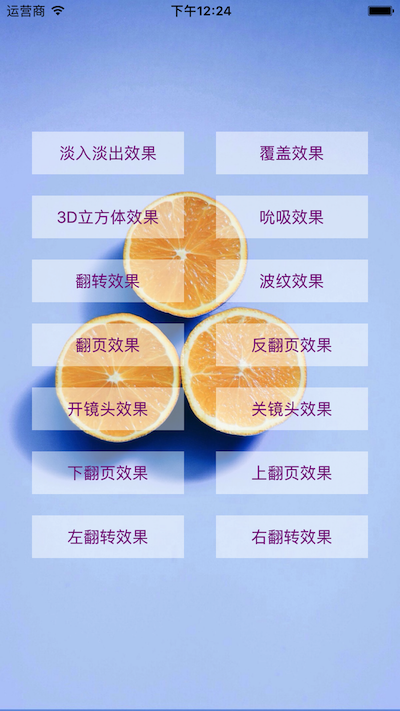

# CAAnimationUtil

Demo集合了CAAnimation和UIView中常用的动画效果，原作者来自[这里](https://github.com/lizelu/CATransitionDemo)，感谢O(∩_∩)O。本人是处女座，对代码风格要求有点变态🤦‍♀️🤦‍♀️，为了自己看着舒心以及方便查阅，重新写了Demo。



### 说明

Demo涵盖很多动画效果，具体如下：

```ruby
typedef NS_ENUM(NSInteger,AnimationType) {
    kAnimationTypeFade,                         //淡入淡出
    kAnimationTypeMoveIn,                       //覆盖
    kAnimationTypePush,                         //推挤
    kAnimationTypeReveal,                       //揭开
    kAnimationTypeCube,                         //3D立方体
    kAnimationTypeSuckEffect,                   //吮吸
    kAnimationTypeOglFlip,                      //翻转
    kAnimationTypeRippleEffect,                 //波纹
    kAnimationTypePageCurl,                     //翻页
    kAnimationTypePageUnCurl,                   //反翻页
    kAnimationTypeCameraIrisHollowOpen,         //开镜头
    kAnimationTypeCameraIrisHollowClose,        //关镜头
    kAnimationTypeCurlDown,                     //下翻页
    kAnimationTypeCurlUp,                       //上翻页
    kAnimationTypeFlipFromLeft,                 //左翻转
    kAnimationTypeFlipFromRight                 //右翻转
} ;
```
其中包含8个私有API，使用过程需要留意，私有API是不被AppStore接受的。

```ruby
NSString *const kCATransitionCube = @"cube";  
NSString *const kCATransitionSuckEffect = @"suckEffect"; 
NSString *const kCATransitionOglFlip = @"oglFlip";  
NSString *const kCATransitionRippleEffect = @"rippleEffect";  
NSString *const kCATransitionPageCurl = @"pageCurl"; 
NSString *const kCATransitionPageUnCurl = @"pageUnCurl";   
NSString *const kCATransitionCameraIrisHollowOpen = @"cameraIrisHollowOpen";
NSString *const kCATransitionCameraIrisHollowClose = @"cameraIrisHollowClose";
```


### 使用方式

1.CAAnimation动画使用方式如下：

```ruby
- (void)transitionWithType:(NSString *)type subtype:(NSString *)subtype
{
    CATransition *animation = [CATransition animation];
    // 动画时间
    animation.duration = DURATION;
    // 动画类型
    animation.type = type;
    // 动画子类型
    if (subtype) {
        animation.subtype = subtype;
    }
    // 动画缓冲|速度
    animation.timingFunction = UIViewAnimationOptionCurveEaseInOut;
    [self.view.layer addAnimation:animation forKey:@"animation"];
}
```

2.UIView动画使用方式如下：

```objc
- (void)animationWithTransition:(UIViewAnimationTransition)transition
{
    [UIView animateWithDuration:DURATION animations:^{
        // 详见UIViewAnimationCurve
        [UIView setAnimationCurve:UIViewAnimationCurveEaseInOut];
        [UIView setAnimationTransition:transition forView:self.view cache:YES];
    }];
}                            
```

PS：动画是直接加在self.view上的，可根据需要自行修改，具体效果见Demo吧。


